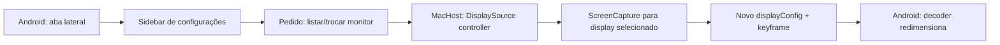

# Plano Técnico - Sidebar remota e seleção de monitor

**Status:** Aguardando aprovação  
**Data:** 2026-07-01  
**HTML visual:** [plano-sidebar-remota-selecao-monitor-2026-07-01.html](./plano-sidebar-remota-selecao-monitor-2026-07-01.html)

> Este Markdown é a fonte da verdade para execução. O HTML é apenas o painel visual de aprovação.

## 1. Entendimento

**Tarefa:** pesquisar a melhor forma de substituir o botão/overlay de configurações do Android por uma sidebar minimalista no modo remoto stand-alone, e planejar como permitir a seleção de qual monitor real do Mac deve aparecer no app.

**Escopo:** AndroidClient UI de sessão remota, preferências locais do Android, protocolo stream/control, seleção de `DisplaySource` no MacHost, reinício de captura/encoder e testes de multi-monitor.

**Premissas:**

- O modo principal é Remote Desktop, não Extended Display.
- A sidebar deve ser acionável no Android durante uma sessão remota, sem depender de abrir a janela de Settings do Mac.
- A seleção de monitor deve funcionar com mais de um monitor real conectado ao Mac.
- A troca ideal não deve derrubar a sessão inteira; se isso ficar instável, reconexão vira fallback.
- Não existe `AGENTS.md` dentro deste repo. Foram seguidas as instruções fornecidas no chat.

**Opinião direta:** a sidebar é uma boa troca. O botão flutuante atual funciona, mas para controle remoto ele briga com o próprio objetivo do app: ver e controlar o Mac com o mínimo de UI Android em cima. Para seleção de monitor, o caminho correto é fazer o Mac ser a fonte da verdade e o Android apenas pedir/listar/trocar a fonte.



## 2. Exploração

**Arquivos analisados:**

| Arquivo | Por que importa |
|---------|-----------------|
| `README.md` | Confirma stack, modos USB/Wireless, Virtual Display e foco em baixa latência. |
| `remote-mac-terminal/remote-mac-terminal-spec/remote-mac-terminal-spec/02-SIDESCREEN-DEEP-DIVE.md` | Descreve o pipeline atual de vídeo, input e transporte. |
| `remote-mac-terminal/remote-mac-terminal-spec/remote-mac-terminal-spec/03-TARGET-ARCHITECTURE.md` | Define Remote Desktop como modo principal e `DisplaySourceService` como camada esperada. |
| `remote-mac-terminal/remote-mac-terminal-spec/remote-mac-terminal-spec/07-IMPLEMENTATION-ROADMAP.md` | Já lista seletor simples de tela real como item de Beta/UX. |
| `MacHost/Sources/DisplaySource.swift` | Já modela `remoteDesktop`, `extendedDisplay`, `ExistingDisplaySource` e `VirtualDisplaySource`. |
| `MacHost/Sources/AppDelegate.swift` | Hoje cria fonte remota com `.existing(.main())`; é o gargalo multi-monitor. |
| `MacHost/Sources/ScreenCapture.swift` | Captura por `displayID` usando ScreenCaptureKit e fallback `CGDisplayStream`. |
| `MacHost/Sources/StreamingServer.swift` | Já é video/control socket: display config, ping/pong, keyframe request e touch legacy. |
| `MacHost/Sources/SettingsWindow.swift` | Settings do Mac já tem seletor de modo, status de display source e persistência de `DisplaySettings`. |
| `MacHost/Tests/SideScreenTests/DisplaySourceTests.swift` | Testes existentes para fonte remota/virtual e default remote desktop. |
| `AndroidClient/app/src/main/res/layout/activity_main.xml` | Contém `SurfaceView`, status overlay, botão de settings e painel principal. |
| `AndroidClient/app/src/main/java/com/sidescreen/app/MainActivity.kt` | Controla conexão, overlay, settings dialog, pointer capture, input e decoder. |
| `AndroidClient/app/src/main/res/layout/dialog_settings.xml` | Controles atuais de overlay, input, mouse, scroll, meta key e disconnect. |
| `AndroidClient/app/src/main/java/com/sidescreen/app/PreferencesManager.kt` | Persistência atual de overlay, posição do botão e ajustes de input. |
| `AndroidClient/app/src/main/java/com/sidescreen/app/StreamClient.kt` | Recebe display config e envia comandos pequenos como ping/keyframe/touch. |
| `AndroidClient/app/src/main/java/com/sidescreen/app/InputClient.kt` | Canal de input separado; não deve carregar comandos de UI/display. |
| `MacHost/Sources/InputServer.swift` | Confirma canal dedicado para input e fail-safe de sessão. |
| `AndroidClient/app/src/main/res/values/strings.xml` | Quase vazio; a maior parte da UI ainda está hardcoded em layouts/código. |
| `AndroidClient/app/build.gradle.kts` | Usa Kotlin, ViewBinding, ConstraintLayout e Material Components; não há DrawerLayout hoje. |
| `MacHost/Package.swift` | Swift Package com macOS 13+, Swift 5.9 e testes XCTest. |

**Stack identificada:**

| Área | Stack |
|------|-------|
| MacHost | Swift, AppKit/SwiftUI, Network.framework, ScreenCaptureKit, CoreGraphics, VideoToolbox, XCTest |
| AndroidClient | Kotlin, Android Views/XML, ConstraintLayout, Material Components, SurfaceView, MediaCodec, JUnit |
| Transporte | TCP próprio para video/control, TCP separado para input |

**Comandos de validação encontrados/recomendados:**

| Alvo | Comando |
|------|---------|
| Mac tests | `cd MacHost && swift test` |
| Android unit tests | `cd AndroidClient && ./gradlew testDebugUnitTest` |
| Android build | `cd AndroidClient && ./gradlew assembleDebug` |
| Preflight amplo | `./scripts/preflight.sh --full` |
| Smoke real com tablet | `./scripts/android-device-smoke.sh --duration 180 --expect-stream` |
| Input QA manual | `./scripts/open-input-qa.sh` |

**Referências externas usadas na pesquisa:**

- Apple Developer, ScreenCaptureKit `SCDisplay`: https://developer.apple.com/documentation/screencapturekit/scdisplay
- Apple Developer, Quartz Display Services: https://developer.apple.com/documentation/coregraphics/quartz-display-services
- Android Developer, gesture navigation conflicts and exclusion: https://developer.android.com/develop/ui/views/touch-and-input/gestures/gesturenav
- Android Developer, `DrawerLayout`: https://developer.android.com/reference/androidx/drawerlayout/widget/DrawerLayout

## 3. Impacto Técnico

**Afeta contratos entre módulos?** Sim.

| Área | Arquivo/módulo | Mudança necessária | Contrato afetado |
|------|----------------|-------------------|------------------|
| Mac display source | `MacHost/Sources/DisplaySource.swift` | Adicionar catálogo/listagem de displays reais e seleção por `displayID`. | Sim |
| Mac settings | `MacHost/Sources/SettingsWindow.swift` | Persistir `selectedRemoteDisplayID`, mostrar display selecionado e fallback. | Sim |
| Mac pipeline | `MacHost/Sources/AppDelegate.swift` | Trocar `.existing(.main())` por display selecionado, validar display online e reiniciar captura ao trocar. | Sim |
| Capture | `MacHost/Sources/ScreenCapture.swift` | Expor troca de display ou helper de rebuild da captura sem derrubar tudo. | Sim |
| Stream/control protocol | `MacHost/Sources/StreamingServer.swift`, `AndroidClient/.../StreamClient.kt` | Adicionar capability e mensagens de lista/troca de displays com payload length-prefixed. | Sim |
| Android UI | `AndroidClient/app/src/main/res/layout/activity_main.xml` | Substituir botão flutuante por handle lateral + painel lateral. | Não no wire, sim na UX |
| Android settings | `AndroidClient/.../MainActivity.kt`, `PreferencesManager.kt` | Controlar estado da sidebar, lado escolhido, gestos, controles existentes e seleção de display. | Sim |
| I18N | `AndroidClient/app/src/main/res/values/strings.xml` | Mover novos textos para strings. Idealmente começar a reduzir hardcoded novo. | Não externo |
| Testes | `MacHost/Tests`, `AndroidClient/app/src/test` | Cobrir seleção/fallback/protocolo e preferências. | Sim |

**Ordem recomendada:**

1. Criar modelo/catálogo de displays no Mac.
2. Persistir display remoto selecionado e manter fallback para tela principal.
3. Criar protocolo de display control com capability opt-in.
4. Criar sidebar Android com controles existentes.
5. Integrar lista/troca de monitor na sidebar.
6. Otimizar troca em sessão ativa com release de input, display config e keyframe.

## 4. Pesquisa de solução

### Sidebar

| Opção | Prós | Contras | Veredito |
|------|------|---------|----------|
| Manter botão flutuante + dialog | Menor mudança. Reaproveita código. | Continua cobrindo a tela e atrapalha controle remoto. | Não. É o passado com roupa limpa. |
| `DrawerLayout` padrão | Componente conhecido, edge gesture pronta. | Exige dependência nova, mexe no root layout, pode disputar gestos com pointer capture/remote input. | Bom para apps comuns, ruim para este caso. |
| Side sheet custom em `ConstraintLayout` | Sem dependência nova, controle fino de handle, largura, opacidade, gestos e pointer capture. | Precisa implementar estado/animação com cuidado. | Recomendado. |

**Decisão:** implementar side sheet custom. Uma aba lateral estreita fica visível durante a sessão. Toque abre a sidebar; fora dela fecha. O painel deve ter largura fixa responsiva, algo como `min(360dp, 86% da largura)`, com scrim quase transparente ou nenhum scrim para não quebrar a sensação de controle remoto.

### Seleção de monitor

| Opção | Prós | Contras | Veredito |
|------|------|---------|----------|
| Selecionar só no Mac Settings | Simples e rápido. | Péssimo para uso remoto: se você está longe, já perdeu. | Só serve como fallback/debug. |
| Pré-selecionar antes de iniciar servidor | Menos risco técnico. | Não resolve troca durante sessão. | MVP fraco. |
| Android lista e troca via MacHost | Melhor UX e combina com Remote Desktop. | Precisa protocolo e restart de captura. | Recomendado. |

**Decisão:** a sidebar Android deve listar os displays reais do Mac e permitir troca. O MacHost continua sendo fonte da verdade: ele enumera displays, valida se o display ainda existe e comanda a captura.

### Protocolo recomendado

Não usar o canal de input. Input precisa continuar limpo e prioritário.

Usar o socket atual de video/control para comandos raros de display, com capability opt-in para não quebrar clientes antigos.

| Mensagem | Direção | Payload | Função |
|----------|---------|---------|--------|
| `clientSupportsDisplayControl` | Android -> Mac | 1 byte | Cliente sabe receber lista/status de displays. |
| `displayControlJson` | Mac -> Android ou Android -> Mac | tipo + length u32 + JSON UTF-8 | Envelope para lista, seleção e resultado. |

Payloads sugeridos:

```json
{
  "type": "displayList",
  "selectedDisplayId": 1,
  "displays": [
    {
      "id": 1,
      "name": "Built-in Retina Display",
      "isMain": true,
      "width": 3024,
      "height": 1964,
      "scale": 2.0
    }
  ]
}
```

```json
{
  "type": "selectDisplay",
  "displayId": 2
}
```

```json
{
  "type": "selectDisplayResult",
  "displayId": 2,
  "status": "ok"
}
```

## 5. Testes

### Testes existentes relevantes

| Arquivo | O que cobre | Relevância |
|---------|-------------|------------|
| `MacHost/Tests/SideScreenTests/DisplaySourceTests.swift` | Default remote desktop e diferenças entre fonte real/virtual. | Deve ser expandido para seleção/fallback. |
| `MacHost/Tests/SideScreenTests/HandshakeCodecTests.swift` | Compatibilidade de handshake e credenciais de sessão. | Ajuda a evitar quebra de protocolo ao adicionar capability. |
| `MacHost/Tests/SideScreenTests/StreamingProfileTests.swift` | Persistência e defaults de `DisplaySettings`. | Deve cobrir nova preferência `selectedRemoteDisplayID`. |
| `AndroidClient/app/src/test/java/com/sidescreen/app/RemoteInputProtocolTest.kt` | Protocolo de input. | Garante que não vamos enfiar display control no canal errado. |
| `AndroidClient/app/src/test/java/com/sidescreen/app/EndpointModeTest.kt` | Parsing e rede LAN/Tailnet. | Ajuda a preservar wireless/Tailnet ao testar display control. |

### Testes que devem ser ajustados

| Arquivo | Motivo | Ação |
|---------|--------|------|
| `MacHost/Tests/SideScreenTests/DisplaySourceTests.swift` | `ExistingDisplaySource.main()` deixa de ser a única fonte remota. | Adicionar seleção por ID, fallback para main e labels. |
| `MacHost/Tests/SideScreenTests/StreamingProfileTests.swift` | Reset/defaults de settings precisam incluir display remoto selecionado. | Validar default, persistência e reset. |
| Android tests novos ou existentes de preferências | Sidebar terá lado/estado persistidos. | Cobrir defaults e coercion de lado/posição. |

### Novos testes necessários

| Módulo | Arquivo | O que testar | Tipo | Justificativa |
|--------|---------|--------------|------|---------------|
| MacHost | `DisplaySourceCatalogTests.swift` | Enumeração fake, seleção por ID, fallback quando display sumiu. | Unit | Multi-monitor falha fácil quando monitor desconecta. |
| MacHost | `DisplayControlCodecTests.swift` | Encode/decode de payload JSON length-prefixed. | Unit | Evita desalinhamento do stream. |
| MacHost | `DisplaySelectionSettingsTests.swift` | Persistência de `selectedRemoteDisplayID`. | Unit | Evita voltar sempre para tela principal. |
| Android | `DisplayControlMessageTest.kt` | Parsing de lista e resultado. | Unit | Android precisa sobreviver a nomes/resoluções variadas. |
| Android | `SidebarPreferencesTest.kt` | Lado da sidebar, estado default e valores inválidos. | Unit | UI minimalista depende de preferência previsível. |
| Manual QA | `DAILY_USE_QA.md` ou checklist novo | Troca entre monitor 1/2 durante sessão real. | Manual | ScreenCaptureKit e monitores reais precisam de dispositivo de verdade. |

### Edge cases

- Monitor selecionado foi desconectado antes de iniciar.
- Monitor selecionado desaparece durante a sessão.
- `SCShareableContent` não retorna o display mesmo com `CGGetOnlineDisplayList` retornando.
- Display com escala Retina: coordenadas de input devem continuar usando bounds lógicos e vídeo deve usar pixels físicos.
- Troca de monitor durante tecla/mouse pressionado: enviar `AllInputsUp` antes do rebuild.
- Android em modo imersivo com navegação por gestos: handle lateral pode brigar com back gesture.
- Sidebar aberta enquanto pointer capture está ativo.
- Cliente antigo sem support display control.
- Mac antigo/novo misturado com Android antigo/novo.
- AVC/H.264 fallback precisa recalcular tamanho após troca de display.

### O que não precisa de teste novo

- Reimplementar testes de encoder HEVC/H.264: a mudança deve reutilizar `ScreenCapture`/`VideoEncoder`.
- Repetir toda matriz de input HID: só validar release/fail-safe durante troca.
- Testar every-pixel rendering da sidebar em unit test: layout precisa de QA visual/manual.

## 6. I18N

**Novas strings necessárias?** Sim, principalmente Android.

| Chave/área | Texto base | Módulo | Arquivo | Ação |
|------------|------------|--------|---------|------|
| `settings_sidebar_title` | `Settings` | Android | `AndroidClient/app/src/main/res/values/strings.xml` | Criar |
| `settings_sidebar_display` | `Display` | Android | `strings.xml` | Criar |
| `settings_sidebar_overlays` | `Overlays` | Android | `strings.xml` | Criar |
| `settings_sidebar_input` | `Input` | Android | `strings.xml` | Criar |
| `settings_sidebar_disconnect` | `Disconnect` | Android | `strings.xml` | Criar |
| `settings_sidebar_side` | `Sidebar side` | Android | `strings.xml` | Criar |
| `display_current` | `Current display` | Android | `strings.xml` | Criar |
| `display_unavailable` | `Display unavailable` | Android | `strings.xml` | Criar |
| `display_switching` | `Switching display...` | Android | `strings.xml` | Criar |
| `display_switch_failed` | `Could not switch display` | Android | `strings.xml` | Criar |
| `Display Source`/status | Textos existentes do Mac Settings | Mac | `SettingsWindow.swift` | Manter por enquanto; SwiftUI atual usa strings diretas. |

**Arquivos a atualizar:**

- `AndroidClient/app/src/main/res/values/strings.xml`
- `AndroidClient/app/src/main/res/layout/activity_main.xml`
- Novo layout da sidebar, se separado
- `AndroidClient/app/src/main/java/com/sidescreen/app/MainActivity.kt`
- Possível codec/protocolo Android para nomes de displays

**Strings hardcoded a evitar:**

- Novos rótulos da sidebar.
- Mensagens de troca de display.
- Nomes de seções: `Display`, `Input`, `Overlays`.
- Estados: `Switching`, `Unavailable`, `Selected`.

## 7. Riscos e Mitigação

| # | Risco | Probabilidade | Impacto | Mitigação |
|---|-------|---------------|---------|-----------|
| 1 | Troca de display desalinha o stream e trava o decoder. | Média | Tela preta ou crash de decoder. | Enviar novo `displayConfig`, recriar decoder no Android, pedir keyframe forçado e cobrir H.264/HEVC. |
| 2 | DisplayID muda ou display some. | Média | App tenta capturar monitor inexistente. | Validar em catálogo antes de iniciar/trocar; fallback para main; mostrar estado na sidebar. |
| 3 | Sidebar rouba input do controle remoto. | Alta | Mouse/teclado ficam irritantes. | Handle estreito, lado configurável, abrir só por toque/click claro, liberar pointer capture ao abrir e recapturar ao fechar. |
| 4 | Cliente antigo recebe mensagem nova e desconecta. | Média | Regressão de compatibilidade. | Capability opt-in antes de enviar mensagens novas do servidor. |
| 5 | Teclas/botões ficam presos durante troca. | Média | Uso remoto perigoso. | Enviar `AllInputsUp` e encerrar estado do input antes de rebuild de captura. |
| 6 | UI cresce e vira painelão. | Alta | Volta o problema do overlay. | Sidebar curta, seções colapsáveis/tabs simples, só controles de sessão remota. |

## 8. Plano de Implementação

### Wave 1: Modelo de display remoto no Mac

- [ ] Passo 1.1: criar `DisplaySourceCatalog` para listar displays reais com `displayID`, nome, bounds, tamanho físico, escala e `isMain` -> Verificação: unit test com catálogo fake e fallback para main.
- [ ] Passo 1.2: adicionar `selectedRemoteDisplayID` em `DisplaySettings` -> Verificação: teste de persistência/default/reset.
- [ ] Passo 1.3: trocar `makeDisplaySourceForCurrentSettings()` para usar display selecionado em Remote Desktop -> Verificação: teste cobre seleção válida e inválida.
- [ ] Passo 1.4: mostrar display remoto selecionado no Mac Settings como fallback/debug -> Verificação: SwiftUI compila e status mostra fonte ativa.

### Wave 2: Protocolo de display control

- [ ] Passo 2.1: adicionar capability `clientSupportsDisplayControl` no stream/control socket -> Verificação: cliente antigo não recebe mensagens novas.
- [ ] Passo 2.2: criar codec `DisplayControlMessage` length-prefixed com JSON Codable/org.json -> Verificação: testes Swift/Kotlin de encode/decode.
- [ ] Passo 2.3: enviar lista de displays ao conectar e quando Android pedir refresh -> Verificação: log mostra lista e selected ID.
- [ ] Passo 2.4: aceitar `selectDisplay` do Android, validar display e retornar resultado -> Verificação: request inválido não derruba stream.

### Wave 3: Troca de captura em sessão ativa

- [ ] Passo 3.1: criar fluxo `switchRemoteDisplay(displayID:)` no MacHost -> Verificação: unit/integração leve chama seleção e atualiza `activeDisplaySource`.
- [ ] Passo 3.2: antes da troca, liberar input (`AllInputsUp`/drop state) -> Verificação: diagnóstico incrementa release reason.
- [ ] Passo 3.3: reiniciar captura/encoder para o novo display sem parar listener/socket -> Verificação: novo `displayConfig` chega no Android.
- [ ] Passo 3.4: pedir keyframe forçado após troca -> Verificação: Android sai de tela preta e primeiro frame é sync.
- [ ] Passo 3.5: fallback: se rebuild falhar, retornar erro e manter display anterior ou reconectar com mensagem clara -> Verificação: display inválido não mata sessão.

### Wave 4: Sidebar Android

- [ ] Passo 4.1: substituir `settingsButton` por `settingsSidebarHandle` lateral configurável -> Verificação: handle aparece durante sessão e não aparece na tela de conexão.
- [ ] Passo 4.2: criar side sheet custom em `activity_main.xml` ou layout separado incluído -> Verificação: abre/fecha com animação curta e sem resize do `SurfaceView`.
- [ ] Passo 4.3: migrar controles atuais do dialog: stats, input overlay, opacidade, mouse, scroll, meta key, disconnect -> Verificação: controles continuam alterando `PreferencesManager`.
- [ ] Passo 4.4: adicionar preferência de lado da sidebar (`left`/`right`) -> Verificação: lado persiste após restart/orientação.
- [ ] Passo 4.5: ao abrir sidebar, liberar pointer capture; ao fechar, recapturar se sessão/input ativos -> Verificação: mouse não fica preso e volta ao controle remoto.

### Wave 5: Lista e seleção de monitor na sidebar

- [ ] Passo 5.1: Android anuncia suporte a display control e parseia `displayList` -> Verificação: lista aparece com monitor selecionado.
- [ ] Passo 5.2: criar UI de seleção de monitor na sidebar -> Verificação: toque em monitor envia `selectDisplay`.
- [ ] Passo 5.3: mostrar estados `Switching`, `Selected`, `Unavailable` -> Verificação: erros não ficam mudos.
- [ ] Passo 5.4: ao receber novo `displayConfig`, reinicializar decoder se tamanho/rotação mudarem -> Verificação: troca entre monitores de resoluções diferentes funciona.

### Wave 6: QA real e simplificação

- [ ] Passo 6.1: testar Mac com dois monitores reais, HEVC e H.264 quando possível -> Verificação: checklist manual com evidências.
- [ ] Passo 6.2: testar Android com navegação por gestos e três posições de sidebar -> Verificação: sem conflito grave com back gesture.
- [ ] Passo 6.3: rodar `code-simplifier` depois da implementação para reduzir duplicação local -> Verificação: comportamento preservado e testes passam.

## 9. Checklist de Validação

- [ ] Build Mac: `cd MacHost && swift build`
- [ ] Testes Mac: `cd MacHost && swift test`
- [ ] Testes Android: `cd AndroidClient && ./gradlew testDebugUnitTest`
- [ ] Build Android: `cd AndroidClient && ./gradlew assembleDebug`
- [ ] Smoke real: `./scripts/android-device-smoke.sh --duration 180 --expect-stream`
- [ ] Confirmar que um Android antigo não recebe mensagens novas sem capability.
- [ ] Confirmar que Remote Desktop ainda abre na tela principal quando não há seleção.
- [ ] Confirmar que Extended Display continua criando/destruindo virtual display.
- [ ] Confirmar que troca de monitor envia `AllInputsUp`, novo `displayConfig` e keyframe.
- [ ] Confirmar que o input volta após fechar a sidebar.
- [ ] Confirmar que novos textos Android estão em `strings.xml`.

## 10. Revisão Crítica

**Resultado do advogado do diabo:** revisão crítica feita localmente. A ferramenta de subagentes não foi usada porque a política dela exige pedido explícito de delegação/subagente pelo usuário.

| Severidade | Gap encontrado | Evidência | Ajuste aplicado |
|------------|----------------|-----------|-----------------|
| ALTO | Mensagens novas do servidor poderiam derrubar Android antigo. | `StreamClient.kt` desconecta em mensagem desconhecida no receive loop. | Adicionar capability opt-in antes de enviar display control do Mac para Android. |
| ALTO | Trocar display enquanto input está pressionado pode deixar tecla/botão preso. | `InputServer.swift` mantém sessão ativa; `MainActivity.kt` já manda `AllInputsUp` em pause/perda de pointer capture. | Wave 3 inclui release explícito de input antes do rebuild. |
| ALTO | Sidebar lateral pode brigar com pointer capture e navegação por gestos do Android. | `MainActivity.kt` chama `requestPointerCapture()` ao conectar; Android gesture nav usa bordas. | Wave 4 libera capture ao abrir e recaptura ao fechar; lado configurável. |
| MÉDIO | `CGMainDisplayID()` atual ignora multi-monitor. | `AppDelegate.swift` retorna `.existing(.main())` no Remote Desktop. | Wave 1 cria catálogo e seleção persistida. |
| MÉDIO | Reiniciar só captura/encoder pode revelar acoplamento escondido em `ScreenCapture`. | `restartStream()` é privado e assume mesmo `captureDisplayID`. | Wave 3 implementa troca com fallback para reconexão controlada se rebuild falhar. |

## 11. Critérios de Aprovação Humana

- Durante sessão remota, aparece só uma aba lateral minimalista, não um botão flutuante chamativo.
- A sidebar abre/fecha sem atrapalhar o vídeo e sem deixar mouse/teclado presos.
- A sidebar permite escolher entre monitores reais do Mac.
- Trocar monitor atualiza a imagem no Android sem depender da janela Settings do Mac.
- Se o monitor escolhido sumir, o app volta para a tela principal e avisa.
- Extended Display não regride.
- USB, LAN e Tailnet continuam funcionando.

## Status

Nada deve ser implementado até aprovação explícita.
