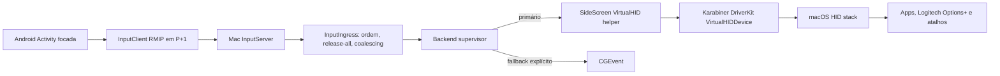

# Plano Técnico - VirtualHID estável

**Status:** Aguardando aprovação  
**Data:** 2026-07-01  
**HTML visual:** [plano-virtualhid-estavel-2026-07-01.html](./plano-virtualhid-estavel-2026-07-01.html)

> Este Markdown é a fonte da verdade para execução. O HTML é apenas o painel visual de aprovação.

## 1. Entendimento

**Tarefa:** planejar a implementação completa e estável do caminho VirtualHID no Side Screen, especialmente para o modo remoto stand-alone em que o Android controla o Mac sem depender do modo de tela extra.

**Escopo:** MacHost input backend, helper privilegiado, instalador, protocolo de input, diagnósticos Mac/Android, scripts de validação, documentação e QA com hardware real.

**Fora de escopo neste pacote:**

- Refazer vídeo, encoder, decoder ou modo Extended Display.
- Criar o modo input-only/sem vídeo. Isso é desejável depois, mas se entrar agora vira poeira demais no motor.
- Trocar TCP por QUIC/WebRTC.
- Suportar teclas HID Consumer/System como mídia, brilho e Mission Control por usage page própria. O alvo inicial é teclado HID page `0x07`, mouse relativo e botões capturados hoje.
- Captura global invisível de input no Android. O caminho correto continua sendo Activity focada, pointer capture e Accessibility opcional.

**Premissas:**

- VirtualHID é o caminho certo para atalhos Logitech/macOS porque o Mac passa a enxergar teclado/mouse como dispositivo HID real. CGEvent continua útil como fallback, mas é automação por cima do sistema e perde em apps/atalhos que esperam hardware.
- O app já tem um esqueleto VirtualHID avançado; o trabalho não é começar do zero. O trabalho é fazer ele parar de mentir quando está quebrado.
- `TextCommit` para acentos, emoji e texto Unicode não é HID puro. Ele hoje usa `UnicodeTextInjector`/CGEvent e deve continuar separado, com UI/documentação honesta.
- Não existe `AGENTS.md` dentro deste repo. Foram seguidas as instruções fornecidas no chat.
- O worktree já estava sujo antes deste plano; a implementação futura deve preservar mudanças existentes do usuário.

**Veredito direto:** dá para fazer, e vale a pena. Mas “VirtualHID completo” não significa “tudo que sai do Android vira HID puro”. Significa: teclado/mouse/atalhos críticos passam pelo caminho HID, falhas ficam visíveis, helper não trava, fallback não é silencioso e QA prova que não fica tecla presa.

## 2. Exploração

**Arquivos analisados:**

| Arquivo | Por que importa |
|---------|-----------------|
| `MacHost/Sources/InputBackendMode.swift` | Seleciona Automatic/CGEvent/VirtualHID, detecta Karabiner/helper e hoje cai para CGEvent sem contrato rico de motivo. |
| `MacHost/Sources/KarabinerVirtualHIDBackend.swift` | Codec Karabiner, cliente direto, cliente do helper e backend que posta reports HID. |
| `MacHost/Sources/VirtualHIDHelperInstaller.swift` | Instala helper em `/Library/PrivilegedHelperTools`, LaunchDaemon por UID e socket `/tmp/sidescreen-virtualhid-<uid>.sock`. |
| `MacHost/VirtualHIDHelperSources/main.swift` | Helper root que recebe comandos locais e fala com o socket root-only do Karabiner. |
| `MacHost/Sources/InputIngress.swift` | Camada anti-tecla-presa: sequência, release-all, coalescing e watchdog. Hoje chama downstream enquanto segura lock. |
| `MacHost/Sources/InputServer.swift` | Canal TCP de input, autenticação, accept response com backend ativo e lifecycle de sessão. |
| `MacHost/Sources/CGEventInputBackend.swift` | Fallback atual; mostra limites de mouse/teclado e o `UnicodeTextInjector` usado também pelo VirtualHID em `TextCommit`. |
| `MacHost/Sources/AppDelegate.swift` | Atualiza status VirtualHID, instala helper e inicia backend/input server. Também exige Screen Recording antes de iniciar o servidor inteiro. |
| `MacHost/Sources/SettingsWindow.swift` | UI de Remote Input, permissões e diagnósticos; precisa parar de tratar “Ready via helper” como alerta em alguns lugares. |
| `MacHost/Tests/SideScreenTests/KarabinerVirtualHIDBackendTests.swift` | Testes existentes de codec, plist e candidatos de helper. Boa base, ainda rasa para falhas reais. |
| `MacHost/Tests/SideScreenTests/RemoteInputProtocolTests.swift` | Testes de protocolo e `InputIngress`. Base para refatorar lock/coalescing sem quebrar ordem. |
| `MacHost/Tests/SideScreenTests/InputServerIntegrationTests.swift` | Testa accept/reject/reconnect do canal de input. Deve cobrir backend status/fallback. |
| `AndroidClient/app/src/main/java/com/sidescreen/app/InputClient.kt` | Conecta no canal RMIP, lê backend id e envia teclado/mouse/text commit. |
| `AndroidClient/app/src/main/java/com/sidescreen/app/RemoteInputProtocol.kt` | Capabilities, envelope e mapeamento HID Android. |
| `AndroidClient/app/src/main/java/com/sidescreen/app/RemoteKeyboardCapture.kt` | Captura teclas na Activity e evita duplicação com Accessibility assist. |
| `AndroidClient/app/src/main/java/com/sidescreen/app/RemoteMouseCapture.kt` | Mouse relativo, wheel e botões primário/secundário/terciário/back/forward. |
| `AndroidClient/app/src/main/java/com/sidescreen/app/SideScreenAccessibilityService.kt` | Assist opcional para teclas; não deve virar requisito do VirtualHID para atalhos HID. |
| `scripts/build_mac.sh`, `scripts/install.sh` | Bundle do helper dentro do app. |
| `scripts/preflight.sh`, `scripts/verify-mac-distribution.sh` | Validação de release; hoje checa helper bundled, não helper instalado/respondendo/injetando. |
| `scripts/open-input-qa.sh`, `scripts/validate-input-qa.sh`, `qa/input-text-harness.html` | Harness de QA de input já existe e deve virar critério obrigatório para VirtualHID. |
| `README.md` | Documentação atual de permissões/input precisa ficar mais precisa sobre VirtualHID, CGEvent e TextCommit. |

**Stack identificada:**

| Área | Stack |
|------|-------|
| MacHost | Swift, AppKit/SwiftUI, Network.framework, CoreGraphics, DriverKit via Karabiner, Unix domain sockets, XCTest |
| Helper | Swift CLI root, LaunchDaemon, AF_UNIX, `getpeereid`, socket root-only do Karabiner |
| Android | Kotlin, Android Views, KeyEvent, MotionEvent, pointer capture, optional AccessibilityService, JUnit |
| Protocolo | TCP próprio RMIP em `P+1`, eventos binários com sequence/timestamp/payload |
| QA/release | Shell scripts, SwiftPM tests, Gradle tests, harness HTML de input, evidência em `qa-evidence/` |

**Estado atual vs lacuna:**

| Peça | Já existe | Lacuna prática |
|------|-----------|----------------|
| Detecção VirtualHID | Verifica app/daemon/socket/helper. | Pode dizer “Ready” só porque arquivo/socket existe; precisa probe real. |
| Helper root | Fala com Karabiner e restringe UID via `getpeereid`. | Single-client bloqueante; sem status/version; app novo/helper velho não é distinguido. |
| Backend VirtualHID | Report keyboard/mouse, release-all, reset. | Falhas viram log; UI não sabe; risco de estado degradado invisível. |
| Seleção de backend | Automatic e modo forçado. | `.virtualHID` cai para CGEvent sem deixar isso impossível de ignorar. |
| Android | Envia HID usage e mostra backend simples. | Não recebe motivo de fallback/falha. |
| TextCommit | UTF-8 para acentos/emoji. | Continua CGEvent; precisa ser tratado como exceção, não como VirtualHID puro. |
| QA | Harness manual forte. | Falta roteiro obrigatório para VirtualHID, helper restart, Karabiner stopped e Logitech Options+. |

## 3. Decisões Técnicas

| Tema | Decisão | Motivo |
|------|---------|--------|
| Caminho primário | VirtualHID via helper privilegiado. | App normal não consegue falar com socket root-only do Karabiner; helper é o caminho viável para app pessoal. |
| Fallback | CGEvent só como fallback explícito no modo Automatic; no modo Virtual HID, fallback deve aparecer como erro/fallback visível. | Fallback silencioso destrói confiança. Se você pediu VirtualHID, precisa saber quando não recebeu. |
| Health | Status só conta como saudável após handshake/probe de protocolo, versão compatível e resposta do helper/Karabiner. | Arquivo, processo e socket não provam que input chega. |
| Helper protocol | Adicionar protocolo novo compatível com legado: comandos atuais continuam; status/version/probe entram sem quebrar app velho. | App novo precisa detectar helper velho; app velho não deve morrer com helper novo. |
| Threading | `InputIngress` não chama backend segurando `NSLock`; operações downstream saem em fila/ordem controlada. | Socket I/O de 1s dentro do lock é receita de input travado. |
| Unicode | Manter `TextCommit` como caminho Unicode separado e documentado. | HID keyboard report não representa texto Unicode arbitrário. Acentos/emoji precisam de outro caminho. |
| Segurança | Endurecer instalador/helper sem tentar migrar para SMAppService agora. | SMAppService/SMJobBless seria uma frente própria. Para app pessoal, dá para estabilizar com assinatura/hash/versão/permissões e logs. |
| QA | Nenhuma aprovação sem hardware real. | Unit test não prova Logitech Options+ nem pointer capture do Android. |

## 4. Impacto Técnico

**Afeta contratos entre módulos?** Sim.

| Área | Arquivo/módulo | Mudança necessária | Contrato afetado |
|------|----------------|-------------------|------------------|
| Status VirtualHID | `MacHost/Sources/InputBackendMode.swift` ou novo `VirtualHIDStatus.swift` | Trocar status booleans por enum operacional com motivo, versão, helper e Karabiner probe. | Sim |
| Cliente/helper | `MacHost/Sources/KarabinerVirtualHIDBackend.swift` | Adicionar `probe/status`, versionamento e callbacks de falha no cliente VirtualHID. | Sim |
| Helper root | `MacHost/VirtualHIDHelperSources/main.swift` | Adicionar status/version, timeouts, atendimento concorrente/serializado e proteção contra cliente ocioso. | Sim |
| Instalador | `MacHost/Sources/VirtualHIDHelperInstaller.swift` | Validar origem do helper, assinatura/hash/versão, plist temporário seguro, status live e reinstalação quando versão divergir. | Sim |
| Backend runtime | `KarabinerVirtualHIDBackend`, `InputBackendFactory` | Propagar falhas visíveis, release-all best effort, degraded state e fallback reason. | Sim |
| Ingress | `MacHost/Sources/InputIngress.swift` | Refatorar flush/coalescing/diagnostics para não executar downstream sob lock. | Sim |
| Input server/protocolo | `MacHost/Sources/InputServer.swift`, `RemoteInputProtocol.swift` | Enviar backend ativo e motivo de fallback/falha para clientes que anunciam capability nova. | Sim |
| Android input | `InputClient.kt`, `RemoteInputProtocol.kt`, diagnósticos UI | Anunciar capability, ler status reason e mostrar “VirtualHID solicitado, CGEvent ativo” quando ocorrer. | Sim |
| UI Mac | `AppDelegate.swift`, `SettingsWindow.swift` | Mostrar helper legacy/outdated/responding, estado degradado e permissão Accessibility condicionada ao backend/text commit. | Não no wire |
| Docs/QA | `README.md`, `scripts/*`, `qa/input-text-harness.html` | Atualizar roteiro, preflight e evidência para VirtualHID. | Não no app runtime |

**Ordem recomendada:** contrato/status primeiro, helper depois, backend/ingress em seguida, UX e QA por último. Fazer UI bonita antes do health real seria pintar o painel do carro sem ligar o motor.

## 5. Testes

### Testes existentes relevantes

| Arquivo | O que cobre | Relevância |
|---------|-------------|------------|
| `KarabinerVirtualHIDBackendTests.swift` | Layout de reports, helper request/response, plist e caminhos de helper. | Expandir para status/version/falhas. |
| `RemoteInputProtocolTests.swift` | Parsing de eventos, TextCommit, `InputIngress` e release-all. | Base para refatorar threading sem regressão. |
| `InputServerIntegrationTests.swift` | Accept/reject/reconnect do canal de input. | Deve cobrir backend status reason e fallback. |
| `RemoteInputProtocolTest.kt` | Protocolo Android e capabilities. | Deve cobrir nova capability de backend status/fallback. |
| `RemoteMouseCapture`/tests existentes de input | Botões e pointer. | Deve validar limites reais de 5 botões capturados pelo Android. |
| `validate-input-qa.sh` | Valida harness e relatórios sem texto sensível. | Deve exigir evidência VirtualHID nos releases/rodadas relevantes. |

### Novos testes necessários

| Módulo | Arquivo sugerido | O que testar | Tipo | Justificativa |
|--------|------------------|--------------|------|---------------|
| MacHost | `VirtualHIDStatusTests.swift` | Enum de status: not installed, daemon stopped, helper legacy, helper not responding, protocol mismatch, ready helper, active failed. | Unit | Evita status otimista falso. |
| MacHost | `SideScreenVirtualHIDHelperProtocolTests.swift` | Comandos atuais compatíveis, status/version novo, app novo contra helper velho e payload inválido. | Unit | Versionamento é onde helper costuma virar armadilha. |
| MacHost | `VirtualHIDHelperInstallerTests.swift` | Plist, paths, shell command, temp path seguro, detecção de versão/hash divergente. | Unit | Instalação root precisa ser previsível e auditável. |
| MacHost | `KarabinerVirtualHIDBackendRuntimeTests.swift` | Fake client falha no begin, keyboard report, pointing report, releaseAll e reset; callback de falha dispara. | Unit | Hoje falha só loga. |
| MacHost | `InputBackendFactoryTests.swift` | Automatic escolhe helper saudável, CGEvent fallback com motivo, VirtualHID forçado não cai silenciosamente. | Unit | Protege a decisão central. |
| MacHost | `InputIngressThreadingTests.swift` | Backend lento não bloqueia lock, flush mantém ordem e release-all sai antes de evento pós-gap. | Unit | Corrige o risco de stuck input por I/O lento. |
| MacHost | `InputServerBackendStatusTests.swift` | Accept response legado e response com status reason quando capability existe. | Integration | Android precisa saber o que aconteceu. |
| Android | `RemoteInputProtocolTest.kt` | Capability de backend status e parsing de accepted backend metadata. | Unit | Mantém compatibilidade wire. |
| Android | `InputClientTest.kt` ou fake socket | Conexão lê backend id + motivo, loga fallback e callback UI recebe razão. | Unit/integration leve | Evita diagnóstico cego no tablet. |
| Android | `RemoteMouseCaptureTest.kt` | Primário/secundário/terciário/back/forward; cancel envia all-inputs-up. | Unit | Alinha promessa de botões ao que o Android captura. |
| Scripts | `validate-input-qa.sh` | Relatório VirtualHID contém backend/transport/layout e checks manuais. | Script test | Preflight deve cobrar evidência útil. |

### QA manual obrigatório

| Cenário | Como validar | Aceite |
|---------|--------------|--------|
| VirtualHID ready helper | Instalar helper, iniciar MacHost, conectar Android. | Mac e Android mostram Virtual HID ativo, sem Accessibility para atalhos HID básicos. |
| Logitech Options+ | Acionar atalhos configurados no Logitech no Mac usando teclado/mouse remoto. | Atalhos que dependem de teclado/mouse HID funcionam como hardware local. |
| Command shortcuts | `Command+C`, `Command+V`, `Command+A`, `Command+Tab`. | Funcionam no harness e visualmente no sistema quando aplicável. |
| Texto PT-BR | `ação, coração, amanhã, útil, você, João`, símbolos e emoji no harness. | Chega idêntico ou falha documentada no caminho TextCommit; sessão não cai. |
| Mouse relativo | Movimento, drag, wheel vertical/horizontal, botões 1-5. | Sem aceleração absurda, sem botão preso. |
| Perda de foco/captura | Perder pointer capture, pausar Android, desligar rede, trocar app. | `Pressed state` volta para `0 keys / 0 buttons`. |
| Helper restart | Matar/reiniciar helper durante sessão. | UI marca degraded/falha, release-all best effort roda, reconexão recupera. |
| Karabiner daemon stopped | Parar daemon Karabiner. | Status vira daemon stopped/upstream failed; fallback em Automatic é claro. |
| CGEvent fallback | Rodar sem helper e em Automatic. | Funciona como fallback, mas Mac/Android deixam claro que não é VirtualHID. |

### Edge cases

- App novo com helper velho sem comando status/version.
- App velho com helper novo.
- Karabiner instalado mas daemon parado.
- Socket existe mas não responde.
- Cliente do mesmo UID conecta no helper e fica ocioso.
- Sequence gap com tecla pressionada e pointer move coalescido pendente.
- Long key hold com ping/heartbeat ativo.
- `TextCommit` grande demais perto de 4094 bytes.
- Mouse back/forward no VirtualHID vs CGEvent fallback.
- Android system keys que o sistema operacional captura antes do app.
- Rebuild ad-hoc que muda identidade TCC e quebra Accessibility/TextCommit.

### O que não precisa de teste novo agora

- Encoder/decoder de vídeo: não é tocado.
- Seleção de monitor: pertence ao plano da sidebar/monitor, não a este pacote.
- Virtual display: só validar que não regrediu no preflight amplo.

## 6. I18N e textos

**Novas strings necessárias?** Sim, principalmente para UI/diagnóstico.

| Área | Texto base | Arquivo | Ação |
|------|------------|---------|------|
| Mac Remote Input | `Virtual HID ready via helper`, `Helper outdated`, `Helper not responding`, `Protocol mismatch`, `Active backend degraded` | `MacHost/Sources/SettingsWindow.swift` | Criar textos claros; o app já usa SwiftUI hardcoded, manter padrão por enquanto. |
| Mac permissões | `Accessibility is required for CGEvent and Unicode text commit, not for basic Virtual HID keyboard/mouse.` | `SettingsWindow.swift`, `README.md` | Corrigir mensagem atual. |
| Android diagnósticos | `Input backend: Virtual HID`, `Fallback: CGEvent (...)`, `Virtual HID unavailable: ...` | `AndroidClient/app/src/main/res/values/strings.xml`, `MainActivity.kt` | Preferir strings em resource para novos textos. |
| Scripts/QA | Mensagens de preflight e checklist VirtualHID. | `scripts/*.sh`, `qa/input-text-harness.html` | Manter português correto nos documentos/checklists e inglês técnico nos scripts quando já for padrão. |

**Regra prática:** qualquer texto novo voltado ao usuário precisa dizer o que fazer, não só o que falhou. “Helper stopped” sozinho é pobre; “Helper stopped. Reinstall or restart helper.” presta serviço.

## 7. Riscos e Mitigação

| # | Risco | Probabilidade | Impacto | Mitigação |
|---|-------|---------------|---------|-----------|
| 1 | Status saudável falso por socket/processo existente. | Alta | Usuário acha que está em VirtualHID, mas input falha. | Probe real com version/status e upstream Karabiner; status “ready” só após resposta. |
| 2 | Helper single-client travar por cliente ocioso. | Média | VirtualHID para de responder até restart. | Timeout de read/write, aceitar cliente em fila dedicada e serializar upstream Karabiner. |
| 3 | Tecla/botão preso após falha de socket. | Média | Experiência péssima e potencial input perigoso. | Release-all best effort, reset no endSession, watchdog, QA de falhas e estado pressionado visível. |
| 4 | Fallback silencioso para CGEvent. | Alta hoje | Debug impossível e atalhos Logitech continuam falhando. | Selection reason, Android/Mac exibem requested vs active backend. |
| 5 | App novo/helper velho ou protocolo incompatível. | Média | Instalação “parece” OK, mas status falha. | Protocolo compatível, helper version, prompt de reinstall e testes de matriz. |
| 6 | Instalador root aceitar helper errado de `.build`. | Média | Segurança ruim e binário antigo instalado. | Validar bundle, assinatura/hash/versão; dev mode explícito para `.build`. |
| 7 | `TextCommit` ainda exigir Accessibility. | Alta | Usuário acha que VirtualHID dispensou tudo e acentos não entram. | UI/documentação separa HID keys de Unicode TextCommit; QA cobre ambos. |
| 8 | Android não captura certas teclas do sistema. | Alta | Alguns atalhos nunca chegam ao Mac. | Documentar limites Android; Accessibility assist continua opcional; foco em teclas capturáveis. |
| 9 | Karabiner muda protocolo/client version. | Média | Reports param de funcionar. | Checar versão/probe e falhar com mensagem clara; manter codec isolado e testado. |
| 10 | Refatoração do lock quebrar ordem do pointer coalescing. | Média | Mouse fica errático ou eventos saem fora de ordem. | Testes de ordem, release-all e coalescing antes/depois. |

## 8. Plano de Implementação

### Wave 1: Contrato de status e seleção

- [ ] Criar modelo `VirtualHIDOperationalStatus` com estado, detalhe, severidade, helper version, protocol version e fallback reason. -> Verificação: testes unitários cobrem todos os estados.
- [ ] Alterar `InputBackendSelection` para carregar `requestedBackend`, `activeBackend`, `fallbackReason` e status operacional. -> Verificação: `InputBackendFactoryTests`.
- [ ] Fazer Automatic preferir VirtualHID somente quando o probe real estiver saudável. -> Verificação: matriz Automatic/CGEvent/VirtualHID forçado.
- [ ] Fazer modo `.virtualHID` parar de cair silenciosamente para CGEvent; se houver fallback, Mac/Android precisam mostrar isso. -> Verificação: integração de accept/status reason.

### Wave 2: Helper protocol e hardening

- [ ] Adicionar status/version/probe ao helper sem quebrar comandos legados. -> Verificação: app novo/helper velho resulta em “helper legacy/outdated”, não em crash.
- [ ] Adicionar timeouts de read/write e impedir cliente ocioso de bloquear o helper. -> Verificação: teste/fixture com cliente que conecta e não manda header.
- [ ] Serializar acesso ao socket Karabiner em fila/lock dedicado, mesmo com atendimento concorrente de clientes. -> Verificação: reports simultâneos não intercalam bytes.
- [ ] Melhorar logs do LaunchDaemon e status live: binary installed, plist installed, socket exists, helper responds, upstream responds. -> Verificação: status UI diferencia cada falha.
- [ ] Endurecer instalador: temp plist não previsível, validação de helper source, versão/hash/assinatura, reinstalação quando divergente. -> Verificação: testes do installer e preflight.

### Wave 3: Backend VirtualHID resiliente

- [ ] Adicionar observer/callback de falha runtime ao `KarabinerVirtualHIDBackend`. -> Verificação: fake client falhando marca degraded.
- [ ] Fazer `beginSession` falhar visivelmente quando `initializeDevices` ou reports vazios falharem. -> Verificação: UI mostra active failed e input server não anuncia VirtualHID saudável.
- [ ] Em falha de evento, rodar release-all best effort, fechar/reabrir cliente quando seguro e orientar reconexão/fallback. -> Verificação: fake failures e QA helper restart.
- [ ] Garantir `endSession` sempre tenta `releaseAll` e `resetDevices`, mas sem mascarar falha em diagnóstico. -> Verificação: testes de reset/release.

### Wave 4: InputIngress sem bloqueio sob lock

- [ ] Refatorar `flushPendingPointerRelativeLocked` para extrair evento sob lock e executar downstream fora. -> Verificação: teste com backend lento.
- [ ] Tirar callbacks de diagnóstico do lock ou emitir snapshot fora do lock. -> Verificação: teste sem deadlock/reentrância.
- [ ] Preservar ordem: pending pointer antes de button/wheel/keyboard/all-inputs-up. -> Verificação: testes existentes continuam passando e novos cobrem release gap.
- [ ] Revisar watchdog de 5s com heartbeat: long hold não deve soltar se pings continuam chegando; perda real deve soltar. -> Verificação: teste de ping durante tecla pressionada.

### Wave 5: Protocolo Mac/Android para fallback reason

- [ ] Adicionar capability de backend status no hello Android. -> Verificação: cliente antigo continua aceito.
- [ ] Estender accept/status do input channel apenas quando capability nova existir. -> Verificação: testes wire legado e novo.
- [ ] Android exibe backend ativo e motivo: `Virtual HID active`, `CGEvent fallback: helper not responding`, etc. -> Verificação: teste de `InputClient` fake server.
- [ ] Mac `Copy Diagnostics` inclui requested backend, active backend, status operacional, helper version e last failure. -> Verificação: snapshot manual/diagnóstico.

### Wave 6: Paridade de input e mensagens honestas

- [ ] Declarar suporte de fase 1: keyboard HID page `0x07`, mouse relativo, wheel e botões capturados pelo Android hoje. -> Verificação: README e UI não prometem Consumer/System usages.
- [ ] Validar modificadores Command/Control/Option/Shift e atalhos Logitech baseados em teclado/mouse. -> Verificação: QA Logitech.
- [ ] Documentar/mostrar `TextCommit` como caminho Unicode via CGEvent, com possível dependência de Accessibility. -> Verificação: UI de permissões não diz que VirtualHID resolve TextCommit.
- [ ] Harmonizar CGEvent fallback: mouse 1-3 apenas, VirtualHID 1-5 no Android atual. -> Verificação: QA e docs.

### Wave 7: UX, scripts e documentação

- [ ] Ajustar `SettingsWindow`: “Ready via helper” é sucesso; status mostra helper outdated/not responding/protocol mismatch/degraded. -> Verificação: inspeção UI e testes de status model.
- [ ] Ajustar bloco de Accessibility: exigida para CGEvent e TextCommit Unicode; não para HID keyboard/mouse VirtualHID saudável. -> Verificação: README e UI consistentes.
- [ ] Atualizar `preflight.sh` com checks opcionais/fortes de VirtualHID: helper bundled, installed, version, responds, Karabiner responds. -> Verificação: dev vs distribution não bloqueia indevidamente.
- [ ] Atualizar `open-input-qa.sh`/harness para perfil VirtualHID e checklist Logitech/helper failure. -> Verificação: `validate-input-qa.sh`.
- [ ] Atualizar README com instalação Karabiner/helper, troubleshooting e limites Android/TextCommit. -> Verificação: leitura sem contradições.

### Wave 8: Validação final

- [ ] Rodar `cd MacHost && swift test`. -> Verificação: todos os testes Swift passam.
- [ ] Rodar `cd AndroidClient && ./gradlew testDebugUnitTest`. -> Verificação: todos os testes Android passam.
- [ ] Rodar `./scripts/preflight.sh --full`. -> Verificação: sem falhas; warnings explicados se ambiente local não tiver hardware.
- [ ] Rodar QA VirtualHID real: `./scripts/open-input-qa.sh --backend VirtualHID ...` e salvar relatório. -> Verificação: relatório JSON validado.
- [ ] Rodar QA de estabilidade de 30 min: `./scripts/collect-qa-evidence.sh --smoke --duration 1800 --expect-stream`. -> Verificação: evidência com backend, input P+1 e sem stuck input.

## 9. Checklist de Validação

- [ ] Build/test Mac: `cd MacHost && swift test`
- [ ] Build/test Android: `cd AndroidClient && ./gradlew testDebugUnitTest`
- [ ] Preflight amplo: `./scripts/preflight.sh --full`
- [ ] Distribuição Mac local: `./scripts/verify-mac-distribution.sh --dev`
- [ ] QA input CGEvent: `./scripts/open-input-qa.sh --backend CGEvent --transport USB`
- [ ] QA input VirtualHID: `./scripts/open-input-qa.sh --backend VirtualHID --transport USB`
- [ ] QA Tailnet/LAN quando aplicável: `./scripts/collect-qa-evidence.sh --smoke --duration 1800 --expect-stream --no-reverse`
- [ ] Evidência de helper restart, Karabiner stopped e network drop.
- [ ] `Copy Diagnostics` do Mac e Android contém backend solicitado, backend ativo, motivo de fallback e último release-all.
- [ ] Documentação revisada para não prometer HID puro para Unicode/TextCommit.

## 10. Revisão Crítica

**Resultado do advogado do diabo:** gaps encontrados e incorporados.

| Severidade | Gap encontrado | Evidência | Ajuste aplicado |
|------------|----------------|-----------|-----------------|
| CRÍTICO | Health por arquivo/socket pode mentir. | `InputBackendMode.swift` status por paths/processo/socket. | Wave 1 exige probe real e estado operacional. |
| CRÍTICO | Arquitetura atual não propaga `active failed`; backend só loga erro. | `InputBackend` não retorna erro; `KarabinerVirtualHIDBackend` faz `catch { debugLog(...) }`. | Wave 3 adiciona observer/callback de falha runtime. |
| ALTO | Helper não tem status/version e precisa tratar app/helper em versões diferentes. | Helper protocol atual só tem quatro comandos. | Wave 2 adiciona protocolo compatível com legado. |
| ALTO | Helper single-client pode bloquear por cliente ocioso. | `accept` chama `handle(clientFd)` inline. | Wave 2 exige timeouts e atendimento que não bloqueie daemon inteiro. |
| ALTO | Instalador root aceita helper de bundle ou `.build` sem validação forte. | `helperSourceCandidates` inclui `.build`; install copia para `/Library/PrivilegedHelperTools`. | Wave 2 exige versão/hash/assinatura e dev mode explícito. |
| CRÍTICO | `InputIngress` chama downstream dentro de `NSLock`. | `flushPendingPointerRelativeLocked` posta no backend sob lock. | Wave 4 torna isso obrigatório, não opcional. |
| MÉDIO | “Mouse 1..32” promete demais. | Android captura 5 botões; CGEvent suporta 3; VirtualHID mascara 32. | Wave 6 limita promessa a 5 no Android atual e documenta CGEvent. |
| MÉDIO | “Teclado HID completo” promete demais. | Backend ignora usage page diferente de `0x07`. | Escopo limita fase 1 a keyboard page `0x07`; Consumer/System ficam fora. |
| ALTO | Android não recebe motivo de fallback. | Accept atual manda só backend id. | Wave 5 adiciona capability/status reason compatível. |
| ALTO | VirtualHID não elimina Accessibility para `TextCommit`. | `TextCommit` usa `UnicodeTextInjector`/CGEvent. | Wave 6 separa HID keyboard/mouse de Unicode TextCommit. |

## 11. Critérios de Aprovação Humana

- O app usa VirtualHID via helper quando saudável e mostra isso no Mac e no Android.
- Se VirtualHID falhar, a falha aparece com motivo claro; fallback para CGEvent nunca passa despercebido.
- Falhas de rede, perda de pointer capture, sequence gap, helper restart e daemon Karabiner parado não deixam tecla ou botão preso.
- Atalhos relevantes para uso real, incluindo Command shortcuts e atalhos Logitech baseados em teclado/mouse, passam em QA com hardware.
- A documentação fica honesta: VirtualHID cobre teclado/mouse HID; Unicode/acento/emoji via TextCommit continua sendo caminho separado.

## Status

Nada deve ser implementado até aprovação explícita.
