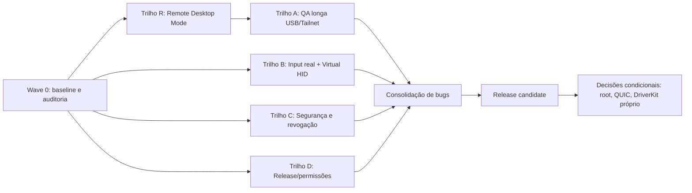

# Plano Técnico - Execução Paralela para Uso Diário

**Status:** Aguardando aprovação  
**Data:** 2026-07-01  
**HTML visual:** [`plano-master-execucao-paralela-2026-07-01.html`](./plano-master-execucao-paralela-2026-07-01.html)

> Este Markdown é a fonte da verdade para execução. O HTML é apenas o painel visual de aprovação.

## 1. Entendimento

**Tarefa:** Transformar a documentação de arquitetura/specs em um plano executável, priorizando paralelismo real, redução de risco e validação de uso diário do Remote Mac Terminal como alternativa minimalista a Google Remote Desktop/AnyDesk.

**Escopo:** Orquestração geral de execução; Remote Desktop Mode em telas reais existentes; MacHost; AndroidClient; Tailnet; canal de input; Virtual HID; segurança de sessão; QA manual com hardware real; scripts de evidência; distribuição Mac/Android.

**Premissas:**

- A base local contém as implementações descritas em `14-DOCUMENTATION-COVERAGE-AND-STATUS.md`. Se houver divergência, a Wave 0 vira auditoria obrigatória antes de qualquer correção.
- O backlog antigo não é fonte confiável de pendência. Ele serve como decomposição técnica, mas o status atual vence.
- Root Android, QUIC e DriverKit próprio ficam fora do caminho crítico. Entram só por medição, não por ansiedade arquitetural.
- Remote Desktop Mode é o produto principal. Extended Display Mode/Virtual Display é modo secundário, herdado do SideScreen.
- O tablet de referência é `SM_X610`, e o host Tailnet citado nos specs é `mac-mini-de-gabriel.tailad333c.ts.net`; o plano deve continuar parametrizável para outro tablet/host.
- O objetivo desta rodada não é “mais código”; é provar que o app permite acessar uma tela real do Mac com simplicidade e aguenta uso real sem virar castelo de cartas.

## 2. Exploração

**Arquivos analisados:**

| Arquivo | Por que importa |
|---------|-----------------|
| `README.md` | Define a estratégia macro: SideScreen como motor de vídeo, Remote Desktop Mode primeiro, novo session/transport layer e input remoto. |
| `00-CODEX-START-HERE.md` | Define ordem obrigatória: sem root primeiro, Tailnet + vídeo, input dedicado, CGEvent, Virtual HID depois. |
| `14-DOCUMENTATION-COVERAGE-AND-STATUS.md` | Fotografia atual. Marca o que já foi implementado e lista lacunas reais de uso diário. |
| `07-IMPLEMENTATION-ROADMAP.md` | Roadmap original MVP/Alpha/Beta/final; útil para classificar trabalho por maturidade. |
| `08-CODEX-TASK-BACKLOG.md` | Backlog técnico granular; usar como catálogo, não como lista cega de pendências. |
| `09-TEST-PLAN.md` | Matriz de validação de rede, vídeo, teclado, mouse, input sob carga, lifecycle, segurança e permissões. |
| `adr/ADR-0007-remote-desktop-first.md` | Define que tela real existente é o modo principal; Virtual Display é secundário. |
| `05-INPUT-ARCHITECTURE-SPEC.md` | Define InputIngress, backends, fail-safe, coalescing e responsabilidades do input profissional. |
| `11-REMOTE-INPUT-PROTOCOL-V1.md` | Define envelope, sequence, timestamp, eventos, `AllInputsUp`, ping/pong e regras de coalescing. |
| `12-SESSION-AND-TRANSPORT-SPEC.md` | Define canais separados, sessão, autorização de canais e prioridade `INPUT > CONTROL > VIDEO > TELEMETRY`. |
| `13-SECURITY-MODEL.md` | Define token, device registry, revogação, logs seguros, permissões e fail-safe como segurança. |
| `04-TAILSCALE-NETWORKING-SPEC.md` | Define MagicDNS/IP 100.x, QR Tailnet, remoção de bind Wi-Fi e split tunneling. |
| `06-ANDROID-LIMITATIONS-AND-ROOT-PLAN.md` | Define limites sem root e o que não deve ser tratado como bug do produto. |

**Stack identificada:** macOS Swift/AppKit/CoreGraphics/ScreenCaptureKit/VideoToolbox; Android Kotlin/Gradle/MediaCodec; TCP multi-canal; Tailscale/MagicDNS/IP 100.x; Karabiner VirtualHID/helper; scripts shell de build, preflight, smoke e coleta de evidência.

**Comandos de validação do projeto:**

```bash
swift test
. scripts/android-env.sh && ./gradlew testDebugUnitTest
./scripts/preflight.sh --full
./scripts/collect-qa-evidence.sh --tap-connect
./scripts/collect-qa-evidence.sh --no-reverse --tailnet-host mac-mini-de-gabriel.tailad333c.ts.net --expect-stream --tap-connect
./scripts/open-input-qa.sh
adb devices -l
tailscale status
```

## 3. Impacto Técnico

**Afeta contratos entre módulos?** Sim, principalmente contratos operacionais de validação, sessão, input e distribuição. A execução proposta evita alterar protocolo sem evidência.

| Área | Arquivo/módulo | Mudança necessária | Contrato afetado |
|------|----------------|-------------------|------------------|
| Orquestração | `14-DOCUMENTATION-COVERAGE-AND-STATUS.md` / planos novos | Converter lacunas reais em waves executáveis e paralelizáveis. | Não |
| Remote Desktop Mode | `DisplaySource` futuro, `ScreenCapture.swift`, UI Mac/Android | Capturar tela real existente como fonte principal sem criar Virtual Display. | Sim |
| QA real | `scripts/collect-qa-evidence.sh`, `qa-evidence/*`, `DAILY_USE_QA.md` | Rodar sessões longas USB/Tailnet e salvar evidências comparáveis. | Não |
| Input | `InputIngress.swift`, `InputClient.kt`, `RemoteInputProtocol.*`, `RemoteMouseCapture.kt`, `RemoteKeyboardCapture.kt` | Corrigir apenas bugs encontrados em hardware real; não redesenhar v1 sem métrica. | Sim, se alterar framing/eventos |
| Virtual HID | `KarabinerVirtualHIDBackend.swift`, `VirtualHIDHelperInstaller.swift`, `VirtualHIDHelperSources/main.swift` | Validar backend real, fallback CGEvent e mensagens de permissão. | Sim |
| Segurança | `RemoteSessionStore.swift`, `WirelessAuth.swift`, `AuthHandshake.kt`, `InputServer.swift` | Validar revogação/reset durante sessão ativa e input channel sem sessão. | Sim |
| Tailnet | `EndpointMode.*`, `EndpointAdvertiser.swift`, `NetworkRoute.kt`, `PairingURL.*` | Só ajustar se QA mostrar regressão em MagicDNS/IP 100.x/split tunneling. | Sim |
| Distribuição | `scripts/build_mac.sh`, notarização, keystore Android, release scripts | Sair de build local para release instalável e reproduzível. | Não, mas afeta instalação |

**Ordem recomendada:** Wave 0 obrigatória → Remote Desktop Mode em tela real → quatro trilhos paralelos → consolidação única → release candidate. Não mexer em root/QUIC/DriverKit próprio antes de fechar QA real.



## 4. Testes

### Testes existentes relevantes

| Arquivo | O que cobre | Relevância |
|---------|-------------|------------|
| `09-TEST-PLAN.md` | Rede, vídeo, teclado, mouse, input sob carga, lifecycle, segurança e permissões. | É a matriz principal da execução. |
| `MacHost/Tests/SideScreenTests/*` | Protocolo, sessão, input ingress, fail-safe, backend e utilitários Mac. | Garante que hardening não quebre estado crítico. |
| `AndroidClient/app/src/test/*` | Parser de QR, NetworkRoute, InputClient, RemoteInputProtocol e comportamento Android. | Protege Tailnet e protocolo. |
| `scripts/collect-qa-evidence.sh` | Coleta preflight, artefatos, Tailnet, assinatura, testes e smoke. | Vira fonte objetiva para aprovação. |
| `scripts/android-device-smoke.sh` | Instala/abre app, toca Connect/Reconnect e valida stream quando solicitado. | Reduz QA manual repetitivo. |
| `scripts/open-input-qa.sh` | Harness de QA manual de input. | Essencial para teclado/mouse Bluetooth e Virtual HID. |

### Testes que devem ser ajustados

| Arquivo | Motivo | Ação |
|---------|--------|------|
| `DAILY_USE_QA.md` | Precisa refletir execução real de 30 min por modo. | Registrar matriz USB/Tailnet, hardware usado, duração, resultado e path de evidência. |
| `scripts/collect-qa-evidence.sh` | Pode precisar consolidar logs de input/hardware/revogação em um pacote só. | Adicionar flags ou seções apenas se a evidência atual não bastar. |
| `scripts/open-input-qa.sh` | Precisa gerar JSON comparável entre CGEvent e VirtualHID. | Garantir saída com backend ativo, teclado, mouse, layout, erros e notas humanas. |
| Testes de segurança existentes | Revogação durante sessão ativa é lacuna real. | Acrescentar teste automatizado se a base permitir simular sessão/input ativa sem hardware. |

### Novos testes necessários

| Módulo | Arquivo | O que testar | Tipo | Justificativa |
|--------|---------|--------------|------|---------------|
| Remote Desktop | `qa-evidence/*` | Captura da tela principal real do Mac sem criar Virtual Display. | e2e/manual | Este é o produto principal, não o modo segundo monitor. |
| Remote Desktop | `qa-evidence/*` | Selecionar monitor externo real e alternar fonte. | e2e/manual | Substituto de AnyDesk precisa ver telas existentes. |
| QA real | `DAILY_USE_QA.md` / `qa-evidence/*` | Tailnet 30 min com vídeo + input dedicado em `P/P+1`. | manual/e2e | O smoke curto provou conexão; uso diário exige duração. |
| QA real | `DAILY_USE_QA.md` / `qa-evidence/*` | USB 30 min com vídeo + input dedicado. | manual/e2e | USB é baseline e não pode regredir. |
| Input | `scripts/open-input-qa.sh` output | Teclado Bluetooth: letras, números, modificadores, acentos/dead keys, ABNT2 quando aplicável. | manual/hardware | Unit test não prova stack Bluetooth/OEM. |
| Input | `scripts/open-input-qa.sh` output | Mouse Bluetooth: relativo, botões, drag, scroll vertical/horizontal. | manual/hardware | É o coração da experiência “MacBook remoto”. |
| Virtual HID | `qa-evidence/*` | Terminal/Finder/navegador/editor com backend VirtualHID ativo e fallback CGEvent documentado. | manual/e2e | Código compilar não prova input como dispositivo real. |
| Segurança | `qa-evidence/*` / teste Mac | Revogar tablet durante stream e confirmar queda/rejeição do input. | manual + unit/integration | Controle remoto do Mac é sensível. |
| Release | `qa-evidence/*` | App assinado/notarizado e Android release assinado rodam os smokes principais. | release smoke | Build local não é produto distribuível. |

### Edge cases

- Tailnet em DERP/relay com RTT alto.
- Remote Desktop Mode criando Virtual Display sem querer.
- Troca de tela real durante stream.
- MagicDNS falha, mas IP 100.x funciona.
- App excluído do split tunneling no Tailscale Android.
- Android perde foco segurando Shift/Command ou botão esquerdo.
- Pointer capture perdido no meio de drag.
- Revogação/reset token enquanto input channel está ativo.
- VirtualHID indisponível ou sem permissão; fallback CGEvent precisa ser explícito.
- Rebuild Mac troca identidade de assinatura e macOS pede TCC de novo.
- Teclas Meta/Home/Power/Recents não chegam ao app sem root; diagnóstico deve tratar como limitação, não como bug.

### O que não precisa de teste novo

- Reescrita de vídeo ScreenCaptureKit/VideoToolbox/MediaCodec: fora do escopo; vídeo existente deve ser validado por smoke e sessão longa.
- Transformar Extended Display Mode no fluxo principal: fora da direção de produto.
- Root Android: futuro intencional; não entra como bloqueador.
- QUIC/single-port: só merece experimento se TCP multi-channel falhar em métrica real.
- DriverKit próprio: Karabiner VirtualHID/helper cobre o caminho prático atual.

## 5. I18N

**Novas strings necessárias?** Sim, apenas se os trilhos revelarem lacuna de UX/diagnóstico.

| Chave/área | Texto base | Módulo | Arquivo | Ação |
|------------|------------|--------|---------|------|
| Diagnóstico Tailnet | “Tailscale/VPN não parece ativo para este app.” | Android | `DiagLog.kt` / UI Wireless | Criar/ajustar se ausente |
| Input backend | “Backend de input ativo: Virtual HID / CGEvent fallback.” | Mac/Android | Settings/diagnóstico | Criar/ajustar se ausente |
| Revogação | “Este tablet foi revogado. Escaneie um novo QR para parear novamente.” | Android | UI de conexão | Criar/ajustar se ausente |
| Permissões macOS | “Conceda Screen Recording, Accessibility e Input Monitoring para habilitar vídeo/input.” | Mac | Settings/onboarding | Criar/ajustar se ausente |
| VirtualHID indisponível | “Virtual HID indisponível; usando fallback CGEvent.” | Mac | Settings/diagnóstico | Criar/ajustar se ausente |

**Arquivos a atualizar:**

- `AndroidClient/app/src/main/res/values/strings.xml`, se existir.
- UI/Settings Android, se strings ainda estiverem hardcoded.
- UI/Settings Mac, se strings ainda estiverem hardcoded.
- Documentação de QA se mensagens forem alteradas.

**Strings hardcoded a evitar:**

- Mensagens de erro Tailnet.
- Mensagens de permissão macOS.
- Status de backend de input.
- Avisos de limitação sem root.
- Mensagens de revogação/re-pair.

## 6. Riscos e Mitigação

| # | Risco | Probabilidade | Impacto | Mitigação |
|---|-------|---------------|---------|-----------|
| 1 | O plano tratar specs como código real e ignorar divergência local. | Média | Retrabalho e falso progresso. | Wave 0 compara specs, testes e código antes de correção. |
| 2 | QA longa consumir tempo humano demais. | Alta | Gargalo no tablet/hardware. | Separar automações em paralelo e reservar tablet só para sessões que precisam dele. |
| 3 | VirtualHID falhar por permissão/driver. | Média | Produto volta a parecer remote desktop comum. | Fallback CGEvent documentado, checklist de permissões e smoke específico. |
| 4 | Input parecer bom em unit test e ruim com Bluetooth real. | Alta | Experiência diária ruim. | `open-input-qa.sh` + matriz hardware real vira gate. |
| 5 | Revogação funcionar no código, mas não derrubar sessão ativa real. | Média | Risco de segurança. | Teste manual durante stream + teste automatizado se possível. |
| 6 | Release assinado quebrar TCC/notarização. | Média | Usuário não consegue instalar/usar. | Tratar release/permissões como trilho próprio, não como última hora. |
| 7 | Root/QUIC virarem distração antes da estabilidade. | Alta | Complexidade desnecessária. | Bloquear por decisão condicional baseada em evidência. |
| 8 | A execução continuar validando só Virtual Display e chamar isso de Remote Desktop. | Média | Produto correto fica adiado. | Gate explícito de tela real existente antes de aprovação de uso diário. |

## 7. Plano de Implementação

### Wave 0: Baseline, auditoria e congelamento de premissas

- [ ] Passo 0.1: Rodar `swift test` -> Verificação: suíte Mac verde ou lista objetiva de falhas.
- [ ] Passo 0.2: Rodar `. scripts/android-env.sh && ./gradlew testDebugUnitTest` -> Verificação: suíte Android verde ou lista objetiva de falhas.
- [ ] Passo 0.3: Rodar `./scripts/preflight.sh --full` -> Verificação: passes/warnings/falhas arquivados.
- [ ] Passo 0.4: Rodar smoke curto com `./scripts/collect-qa-evidence.sh --tap-connect` -> Verificação: pacote em `qa-evidence/` criado.
- [ ] Passo 0.5: Conferir se o código local contém os módulos citados em `14-DOCUMENTATION-COVERAGE-AND-STATUS.md` -> Verificação: checklist “implementado / ausente / divergente”.
- [ ] Passo 0.6: Congelar trilhos paralelos e dono de cada trilho -> Verificação: cada trilho tem entrada, saída e bloqueadores claros.

### Wave 1: Execução paralela por trilhos

- [ ] Passo 1.R: Trilho Remote Desktop — Implementar/provar `DisplaySource` com tela principal real do Mac -> Verificação: Android mostra tela real, sem Virtual Display criado.
- [ ] Passo 1.R2: Trilho Remote Desktop — Provar seleção/troca de monitor real quando disponível -> Verificação: diagnóstico mostra fonte, resolução e `displayID`.
- [ ] Passo 1.A: Trilho QA — Rodar Tailnet 30 min com `--no-reverse --tailnet-host ... --expect-stream --tap-connect` -> Verificação: vídeo, input `P/P+1`, logs e latência arquivados.
- [ ] Passo 1.B: Trilho QA — Rodar USB 30 min com ADB reverse para `P` e `P+1` -> Verificação: baseline local sem regressão.
- [ ] Passo 1.C: Trilho Input — Rodar `./scripts/open-input-qa.sh` com teclado/mouse Bluetooth -> Verificação: JSON salvo com backend, layout, eventos, falhas e notas.
- [ ] Passo 1.D: Trilho VirtualHID — Testar Terminal, Finder, navegador e editor com VirtualHID ativo -> Verificação: backend ativo documentado; fallback CGEvent documentado se acionado.
- [ ] Passo 1.E: Trilho Segurança — Revogar tablet durante stream ativo -> Verificação: stream/input caem, reconexão é rejeitada e logs não expõem segredo.
- [ ] Passo 1.F: Trilho Release — Validar assinatura Mac, TCC, notarização pendente/ativa e Android release signing -> Verificação: matriz release preenchida.

### Wave 2: Consolidação cirúrgica de bugs

- [ ] Passo 2.1: Classificar achados em `BLOCKER`, `HIGH`, `MEDIUM`, `LOW` -> Verificação: cada achado tem reprodução, evidência e owner.
- [ ] Passo 2.2: Corrigir apenas bugs que bloqueiam uso diário ou segurança -> Verificação: diff pequeno e teste específico.
- [ ] Passo 2.3: Reexecutar testes afetados, não a fazenda inteira a cada microcorreção -> Verificação: tempo de feedback menor sem perder cobertura.
- [ ] Passo 2.4: Atualizar docs/QA apenas quando comportamento real mudou -> Verificação: specs continuam fonte confiável.

### Wave 3: Release candidate interno

- [ ] Passo 3.1: Rodar `./scripts/preflight.sh --full` final -> Verificação: 0 falhas; warnings aceitos explicitamente.
- [ ] Passo 3.2: Rodar smoke Tailnet real final -> Verificação: pacote de evidência com stream e input.
- [ ] Passo 3.3: Rodar smoke USB final -> Verificação: não regressão do caminho local.
- [ ] Passo 3.4: Rodar QA input final com hardware -> Verificação: teclado/mouse aprovado ou limitações documentadas.
- [ ] Passo 3.5: Emitir decisão “pronto para uso diário / não pronto” -> Verificação: critérios humanos da seção 10 preenchidos.

### Wave 4: Decisões condicionais pós-RC

- [ ] Passo 4.1: Avaliar se TCP multi-channel é gargalo real -> Verificação: métricas de input/video latency justificam ou rejeitam QUIC.
- [ ] Passo 4.2: Avaliar se VirtualHID/helper é suficiente -> Verificação: só abrir DriverKit próprio se houver bloqueio comprovado.
- [ ] Passo 4.3: Avaliar root discovery passivo -> Verificação: só iniciar se limitações sem root bloquearem seu uso real.

## 8. Checklist de Validação

- [ ] Build dos módulos alterados: `swift test` e `. scripts/android-env.sh && ./gradlew testDebugUnitTest`
- [ ] Testes relevantes: `./scripts/preflight.sh --full`
- [ ] Lint/typecheck relevantes: usar o que já existir no projeto; se não existir, não inventar ferramenta nesta rodada.
- [ ] Confirmar que testes novos passam.
- [ ] Confirmar que testes afetados foram atualizados.
- [ ] Confirmar que I18N foi atualizado, quando aplicável.
- [ ] Confirmar critérios de aceite do HTML visual.
- [ ] Confirmar pacote de evidência Tailnet 30 min.
- [ ] Confirmar pacote de evidência USB 30 min.
- [ ] Confirmar captura de tela real existente em Remote Desktop Mode.
- [ ] Confirmar input QA com hardware Bluetooth real.
- [ ] Confirmar VirtualHID real ou fallback CGEvent explicitamente documentado.
- [ ] Confirmar revogação durante sessão ativa.
- [ ] Confirmar que root/QUIC/DriverKit próprio continuam fora do caminho crítico, salvo evidência contrária.

## 9. Revisão Crítica

**Resultado do advogado do diabo:** gaps abaixo.

| Severidade | Gap encontrado | Evidência | Ajuste aplicado |
|------------|----------------|-----------|-----------------|
| CRÍTICO | O plano poderia virar uma lista de tarefas antiga e ignorar que várias coisas já foram implementadas. | `14-DOCUMENTATION-COVERAGE-AND-STATUS.md` marca implementações e lacunas reais. | Wave 0 obriga comparação com status atual e código local. |
| ALTO | Há gargalo físico: o mesmo tablet/hardware não roda QA Tailnet, USB e input simultaneamente. | Lacunas de uso diário dependem do `SM_X610` e periféricos Bluetooth. | Paralelismo separado em automação vs. testes com recurso físico único. |
| ALTO | VirtualHID pode compilar, mas falhar na prática por permissão/system extension. | Specs indicam que helper/Karabiner precisam smoke real. | Plano dedicado de VirtualHID e fallback CGEvent. |
| MÉDIO | Release pode ser deixado para o fim e revelar problema de TCC/notarização tarde demais. | Preflight ainda tinha warnings de notarização/credenciais. | Release/permissões vira trilho paralelo desde Wave 1. |
| MÉDIO | Root e QUIC são tecnicamente interessantes e podem roubar foco. | Specs classificam ambos como futuro condicional. | Wave 4 só permite decisão por métrica. |

## 10. Critérios de Aprovação Humana

Estes são os itens que devem aparecer resumidos no HTML:

- O app mostra e controla uma tela real existente do Mac em Remote Desktop Mode.
- O app roda por 30 min via Tailnet no tablet real, com vídeo e input dedicado funcionando.
- O app roda por 30 min via USB sem regredir o caminho local.
- Teclado e mouse Bluetooth passam na matriz manual essencial: digitação, modificadores, drag, scroll e desconexão sem tecla presa.
- VirtualHID funciona em apps reais do macOS ou o fallback CGEvent fica claramente documentado como limitação temporária.
- Revogar/resetar o tablet durante sessão ativa derruba input/stream e impede reconexão sem novo pareamento.
- O pacote de evidências permite reproduzir o estado da aprovação sem “confia em mim”.
- Release Mac/Android tem caminho claro: assinatura, permissões, notarização/keystore e warnings explicitamente aceitos ou resolvidos.

## Status

Nada deve ser implementado até aprovação explícita.
